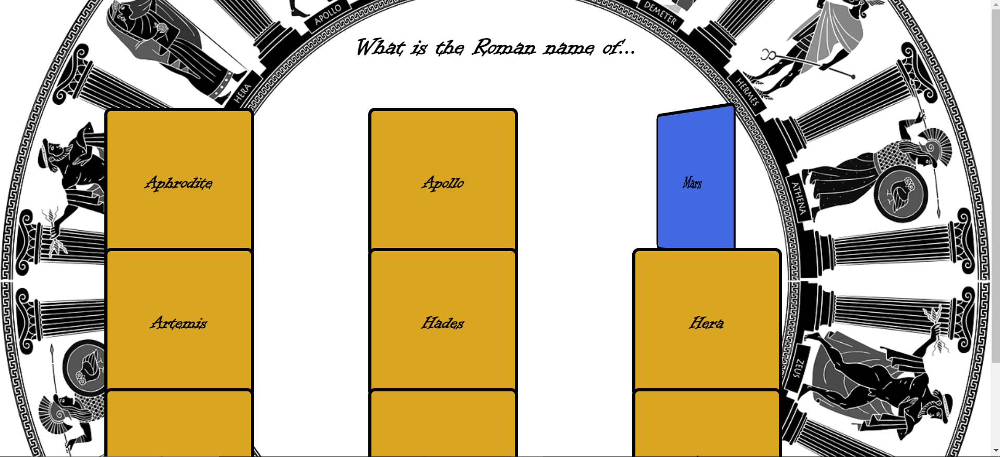

# Hyperskill-JavaScript-FlashCards
A simple Website for memorizing the mythological Greek Gods' Roman names, as part of the Hyperskill React/ JavaScript course from Jetbrains.

you can view it semi-live here: 
https://mzak2.github.io/Hyperskill-JavaScript-FlashCards/
  

Here is a picture of the site: 

